# Advanced Recommender System Architectures: From E-Commerce to Bioinformatics

**Prepared by:** Amirhossein Mahmoudi  
**Institution:** Sharif University of Technology  
**Context:** M.Sc. Algorithms in Bioinformatics Presentation

---

## 1. General Terminology Mapping

To bridge the gap between traditional recommendation systems and bioinformatics, we must first map the foundational entities. In computer science, recommender systems were built for e-commerce and media. In bioinformatics, we apply the exact same mathematical frameworks to biological entities.

| E-Commerce / Movies | Bioinformatics Translation | Brief Biological Definition |
| :--- | :--- | :--- |
| **User** | Drug, Disease, or Patient | The primary entity we want to make a prediction for. |
| **Item (Movie)** | Target Protein, Gene, or Microbe | The secondary entity that interacts with the primary one. |
| **Rating (1-5 Stars)** | Binding Affinity (Kd/IC50) | A score of how strongly a drug physically attaches to a protein. Lower Kd means stronger binding. |
| **Movie Genre / Actor** | SMILES, Morgan Fingerprint | **SMILES**: A text string representing a chemical structure. **Fingerprint**: A binary vector summarizing a chemical's features. |
| **User History** | Multi-omics profile | Comprehensive biological data (DNA, RNA, proteins) for a specific patient or cell. |

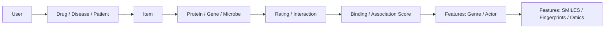

---

## 2. Collaborative Filtering (CF) & Matrix Factorization

### The Movie Domain

* **Intuition:** "People who liked the movies you liked also liked this movie."
* **Mathematical Concept:** Singular Value Decomposition (SVD) or Alternating Least Squares (ALS). We factor a sparse matrix $R$ into two smaller, dense matrices $P$ (user features) and $Q$ (movie features).
* **Real-World Examples & Tools:** Netflix Prize-style SVD, Apache Spark MLlib ALS, Surprise, implicit, and LightFM.
* **Formula:** The goal is to minimize the error between actual ratings $r_{ui}$ and predicted ratings, with an L2 regularization term $\lambda$ to prevent overfitting:

$$
\min_{P,Q} \sum_{(u,i)} (r_{ui} - p_u \cdot q_i^T)^2 + \lambda(||p_u||^2 + ||q_i||^2)
$$

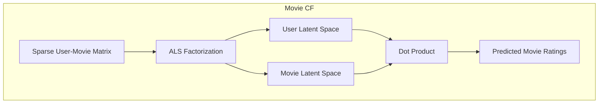

### The Bioinformatics Translation

* **Intuition:** "Drugs that interact with the same proteins as Drug A will also interact with Drug A's other targets."
* **Biological Context:** **Drug-Target Interaction (DTI)**. A matrix where rows are drugs and columns are proteins. A 1 means they bind, 0 means they don't, and ? means it's untested.
* **Usage & Algorithms:** **Probabilistic Matrix Factorization (PMF)**, **Bayesian Personalized Ranking (BPR)**, **Logistic Matrix Factorization**, and **NRLMF** are used for **Drug Repurposing** (finding new uses for existing, approved drugs).
* **Real-World Examples & Tools:** NRLMF for drug-target interaction prediction, PyDTI, DeepPurpose, and chemogenomic DTI benchmark datasets such as Yamanishi.

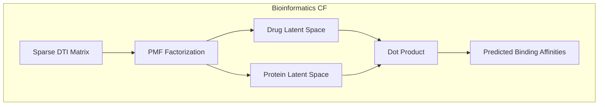

### Concrete Example

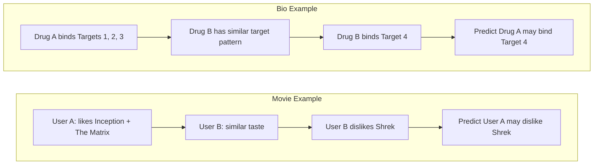

## 3. Content-Based Filtering (CBF)

### The Movie Domain

* **Intuition:** "Because you watched a Sci-Fi movie directed by Christopher Nolan, we recommend another movie with the exact same attributes."
* **Mathematical Concept:** Cosine Similarity. We calculate the cosine of the angle between two multi-dimensional feature vectors.
* **Real-World Examples & Tools:** TF-IDF recommenders, scikit-learn nearest neighbors, Elasticsearch "more like this", and content embeddings in modern catalog search.
* **Formula:**

$$
\text{Cosine}(A, B) = \frac{A \cdot B}{||A|| ||B||}
$$

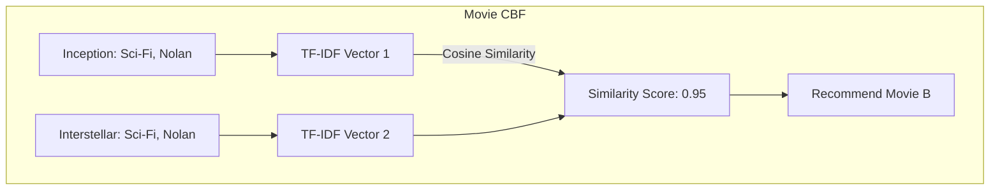

### The Bioinformatics Translation

* **Intuition:** "Because Drug A inhibits Target X, Drug B (which shares a 90% similar chemical sub-structure) will also inhibit Target X."
* **Biological Context:** **Structural Homology**. Molecules with similar shapes often perform similar biological functions. We use chemical fingerprints (arrays of 1s and 0s denoting the presence of specific chemical rings or bonds).
* **Usage & Algorithms:** Calculating the **Tanimoto Coefficient** (Jaccard Index for binary vectors) to compare two Morgan Fingerprints.
* **Real-World Examples & Tools:** RDKit Morgan fingerprints, Open Babel, PubChem similarity search, ChEMBL similarity search, SwissSimilarity, and DeepPurpose.
* **Formula:**

$$
T(A, B) = \frac{A \cdot B}{||A||^2 + ||B||^2 - A \cdot B}
$$

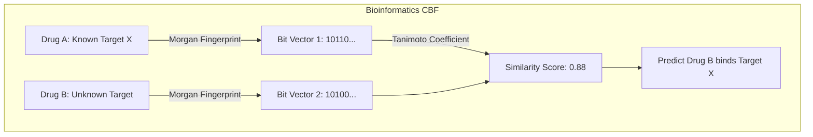

### Concrete Example

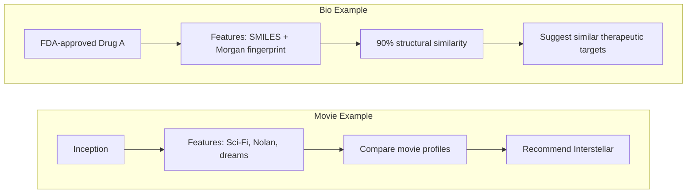

## 4. Graph-Based Methods

### The Movie Domain

* **Intuition:** "Everything is connected. We recommend items based on the probability of a random surfer landing on a specific movie by wandering through the network of users and actors."
* **Mathematical Concept:** Random Walk with Restart (RWR). A walker moves randomly along graph edges, with a probability $c$ of "teleporting" back to the starting node.
* **Real-World Examples & Tools:** PageRank, Personalized PageRank, Neo4j Graph Data Science, NetworkX, igraph, and graph-based recommenders in knowledge graphs.

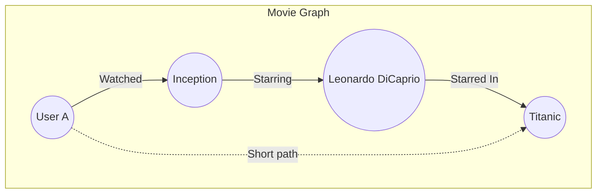

### The Bioinformatics Translation

* **Intuition:** "Disease X is caused by Gene Y, which physically binds to Protein Z. We recommend Drug A because it closely targets Protein Z's neighborhood."
* **Biological Context:** **Protein-Protein Interaction (PPI) Networks**. Maps showing which proteins physically touch and work together in a cell.
* **Usage & Algorithms:** **Disease-Gene Prioritization** using **RWR-HN** (Random Walk on Heterogeneous Networks).
* **Real-World Examples & Tools:** STRING, BioGRID, Cytoscape, Hetionet, OpenTargets, and NetworkX/igraph pipelines for disease-gene prioritization.
* **Formula:** Let $W$ be the transition matrix and $p_t$ be the probability vector at time $t$. The steady state is reached via:

$$
p_{t+1} = (1-c) W p_t + c p_0
$$

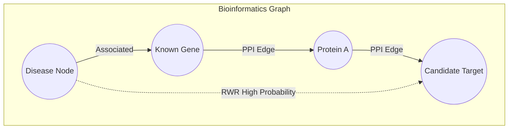

### Concrete Example

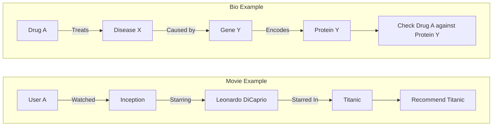

## 5. Deep Learning (Autoencoders)

### The Movie Domain

* **Intuition:** "Compress a user's messy, incomplete watch history into a dense hidden code, then decode it to reconstruct the full profile with missing ratings filled in."
* **Mathematical Concept:** Autoencoder Loss Function. A neural network trained to copy its input to its output through a narrow bottleneck layer.
* **Real-World Examples & Tools:** AutoRec, Variational Autoencoders (VAE), RecVAE, PyTorch, TensorFlow/Keras, and NVIDIA Merlin.

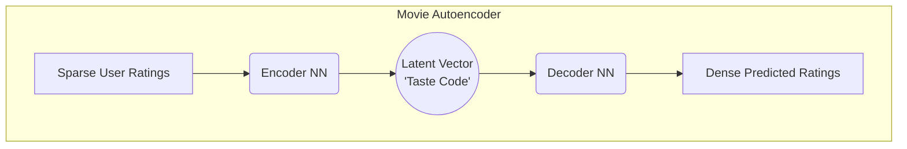

### The Bioinformatics Translation

* **Intuition:** "Biological lab tests are noisy and incomplete. We can map complex cellular profiles into a mathematical space and decode it to predict unobserved biological associations."
* **Biological Context:** **Omics Data (e.g., RNA-Seq)**. Data showing how active thousands of different genes are in a cell. This data is massive and highly correlated.
* **Usage & Algorithms:** **Stacked Denoising Autoencoders (SDAE)** used for Omics Integration. It reduces dimensionality while filtering out biological noise.
* **Real-World Examples & Tools:** DeepDR, scVI/scANVI, DCA, MOFA+, TensorFlow, PyTorch, and Scanpy-based single-cell workflows.
* **Formula:** Minimizing Mean Squared Error (MSE) between input $x$ and reconstruction $\hat{x}$, parameterized by weights $W, b$:

$$
L(x, \hat{x}) = ||x - \sigma(W' \sigma(Wx + b) + b')||^2
$$

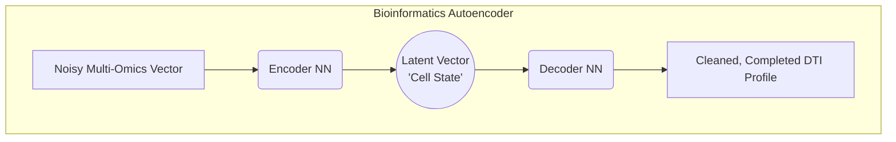

### Concrete Example

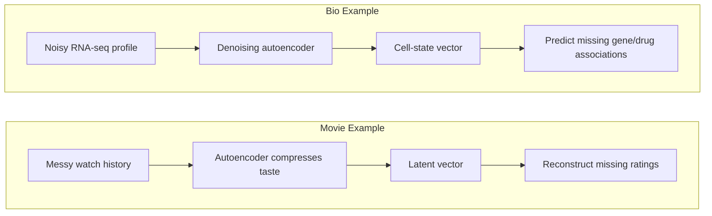

## 6. Graph Neural Networks (GNN)

### The Movie Domain

* **Intuition:** "Nodes (movies) update their own identity vectors by actively listening to and aggregating information from their immediate neighbors (directors, actors)."
* **Mathematical Concept:** Graph Convolution / Message Passing.
* **Real-World Examples & Tools:** PinSage-style graph recommenders, GraphSAGE, LightGCN, PyTorch Geometric, DGL, and StellarGraph.
* **Pseudocode:**

```python
for node in graph:
    neighbor_messages = SUM(features of neighbors)
    node.features = NeuralNet(node.features + neighbor_messages)
```

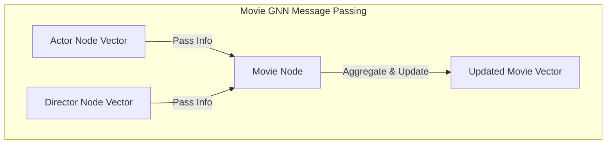

### The Bioinformatics Translation

* **Intuition:** "A drug's chemical properties aren't just a 1D string; they depend on a 2D graph of atoms and bonds. We aggregate information across this graph to predict if the drug is toxic."
* **Biological Context:** **Polypharmacy**. When taking multiple drugs causes unexpected side effects because the drugs interfere with each other's protein networks.
* **Usage & Algorithms:** **Graph Convolutional Networks (GCN)** like the *Decagon* algorithm. Used for side-effect prediction and predicting molecular properties directly from 2D molecular graphs.
* **Real-World Examples & Tools:** Decagon, DeepChem, DGL-LifeSci, PyTorch Geometric, Chemprop, and RDKit-backed molecular graph pipelines.
* **Formula (Layer Update):** Where $A$ is the adjacency matrix, $D$ is the degree matrix, and $H$ is the feature matrix:

$$
H^{(l+1)} = \sigma\left(\tilde{D}^{-\frac{1}{2}} \tilde{A} \tilde{D}^{-\frac{1}{2}} H^{(l)} W^{(l)}\right)
$$

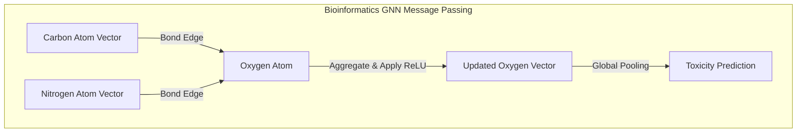

### Concrete Example

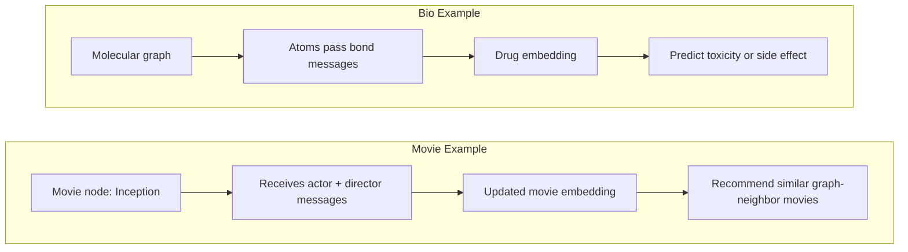

## 7. Reinforcement Learning (RL)

### The Movie Domain

* **Intuition:** "The system is an agent playing a game. It recommends a sequence of items, observes user engagement (reward), and updates its strategy to maximize long-term watch time."
* **Mathematical Concept:** Q-Learning / Markov Decision Process.
* **Real-World Examples & Tools:** Contextual bandits, LinUCB, Thompson Sampling, DQN-style recommenders, Vowpal Wabbit, Ray RLlib, and Microsoft Recommenders.

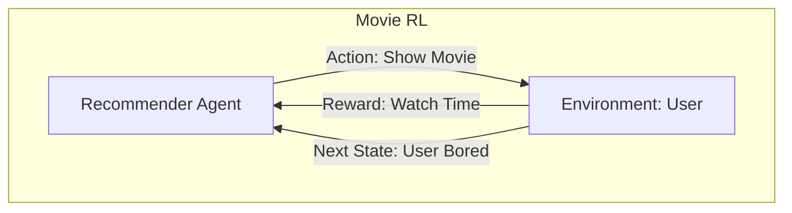

### The Bioinformatics Translation

* **Intuition:** "Instead of recommending an existing drug, let's build a new one atom by atom. If the simulation says it binds well and isn't toxic, we reward the AI."
* **Biological Context:** **De Novo Drug Design**. Creating entirely new molecular structures from scratch. **QED Score**: A metric calculating how "drug-like" a molecule is (safe, stable, soluble).
* **Usage & Algorithms:** **Proximal Policy Optimization (PPO)** in frameworks like GCPN (Graph Convolutional Policy Network).
* **Real-World Examples & Tools:** GCPN, REINVENT, MolDQN, RationaleRL, GuacaMol, MOSES, RDKit, and docking/reward loops with AutoDock Vina.
* **Formula (Bellman Equation):** The expected long-term reward $Q$ of taking action $a$ in state $s$:

$$
Q(s, a) = \mathbb{E} [r_{t+1} + \gamma \max_{a'} Q(s_{t+1}, a') | s_t = s, a_t = a]
$$

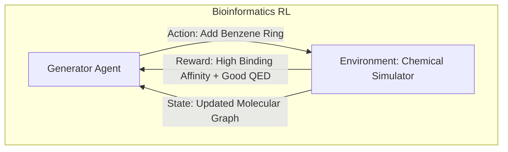

### Concrete Example

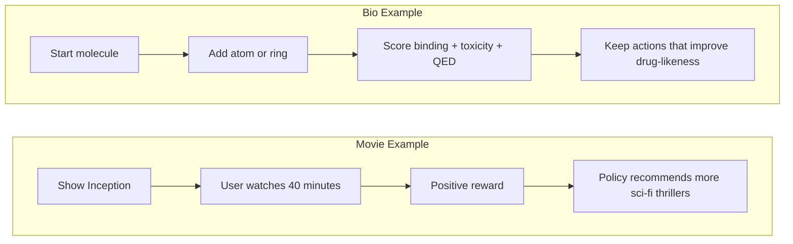

---

## Appendix: Simple Biology Glossary

| Term | Simple Meaning |
| :--- | :--- |
| **DTI** | Drug-target interaction: whether a drug binds to or affects a biological target, usually a protein. |
| **Protein Target** | A protein that a drug tries to bind, block, activate, or modify. |
| **Gene** | A DNA instruction that can be used to make RNA and often a protein. |
| **Disease Gene** | A gene whose mutation or abnormal activity is linked to a disease. |
| **Omics** | Large-scale biological data, such as genomics, transcriptomics, proteomics, or metabolomics. |
| **RNA-seq** | A sequencing method that measures which genes are active by counting RNA molecules. |
| **Multi-omics** | Combining multiple omics layers, such as DNA variants, RNA expression, protein abundance, and metabolites. |
| **SMILES** | A text representation of a molecule's chemical structure. |
| **Morgan Fingerprint** | A binary vector that summarizes small chemical neighborhoods inside a molecule. |
| **Binding Affinity** | How strongly a drug binds to a target; lower Kd or IC50 often means stronger binding. |
| **PPI Network** | Protein-protein interaction network: a graph showing which proteins physically or functionally interact. |
| **QED Score** | A score that estimates how drug-like a molecule is. |
| **Toxicity** | The chance that a molecule causes harmful biological effects. |
| **Drug Repurposing** | Finding a new disease use for an existing drug. |
| **De Novo Drug Design** | Designing a new molecule from scratch instead of selecting an existing one. |
