# Advanced Recommender System Architectures: From E-Commerce to Bioinformatics

**Prepared by:** Amirhossein Mahmoudi  


---

## 1. General Terminology Mapping

To bridge the gap between traditional recommendation systems and bioinformatics, we first map the foundational entities. In computer science, recommender systems were built for e-commerce and media. In bioinformatics, we apply similar mathematical frameworks to biological entities.

| E-Commerce / Movies | Bioinformatics Translation | Brief Biological Definition |
| :--- | :--- | :--- |
| **User** | Drug, disease, or patient | The primary entity we want to make a prediction for. |
| **Item (Movie)** | [Protein target](#protein-target), gene, or microbe | The secondary entity that interacts with the primary one. |
| **Rating (1-5 Stars)** | [Binding affinity](#binding-affinity-kd-and-ic50), [DTI](#dti-drug-target-interaction), association score | A score showing whether, or how strongly, a biological interaction exists. |
| **Movie Genre / Actor** | [SMILES](#smiles), [Morgan fingerprint](#morgan-fingerprint), sequence | Features that describe the item/entity. |
| **User History** | [Omics profile](#omics-profile), [multi-omics](#multi-omics) profile | Biological measurements for a patient, cell, tissue, or disease. |

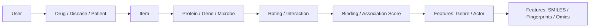

---

## 2. Collaborative Filtering (CF) & Matrix Factorization

### Concrete Example

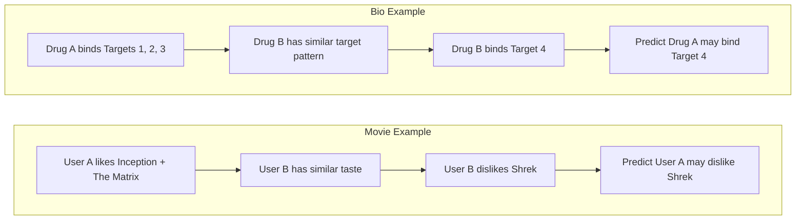

### The Movie Domain

* **Intuition:** "People who liked the movies you liked also liked this movie." It does not care what the movie is about; it cares about who interacted with what.
* **Simple Matrix Example:**

| User | Inception | Toy Story | The Matrix | Shrek |
| :--- | ---: | ---: | ---: | ---: |
| User A | 5 | 1 | 5 | ? |
| User B | 5 | 2 | 4 | 1 |
| User C | 1 | 5 | 1 | 5 |

Here, $r_{ui}$ means the observed rating from user $u$ for item $i$. For example, $r_{\text{User A}, \text{Inception}} = 5$. The missing `?` is what the recommender tries to predict. A matrix factorization model predicts it as:

$$
\hat{r}_{ui} = p_u \cdot q_i^T
$$

where $p_u$ is the learned vector for user $u$, $q_i$ is the learned vector for item $i$, and the dot product measures how compatible they are.

* **Mathematical Concept:** Singular Value Decomposition (SVD) or Alternating Least Squares (ALS). We factor a sparse matrix $R$ into two smaller, dense matrices $P$ (user features) and $Q$ (movie features).
* **Real-World Examples & Tools:** Netflix Prize-style SVD, Apache Spark MLlib ALS, Surprise, implicit, and LightFM.
* **Training Objective:** The goal is to minimize the error between actual ratings $r_{ui}$ and predicted ratings $\hat{r}_{ui}$, with an L2 regularization term $\lambda$ to prevent overfitting:

$$
\min_{P,Q} \sum_{(u,i)} (r_{ui} - p_u \cdot q_i^T)^2 + \lambda(||p_u||^2 + ||q_i||^2)
$$

**Formula symbols:**

| Symbol | Meaning |
| :--- | :--- |
| $R$ | The original user-item matrix. |
| $r_{ui}$ | Known rating/interactions for user $u$ and item $i$. |
| $\hat{r}_{ui}$ | Predicted rating/interactions for user $u$ and item $i$. |
| $P$ | Matrix of learned user vectors. |
| $Q$ | Matrix of learned item vectors. |
| $p_u$ | The learned vector for one user. |
| $q_i$ | The learned vector for one item. |
| $\lambda$ | Regularization strength; keeps vectors from becoming too large. |

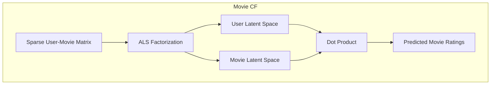

### The Bioinformatics Translation

* **Intuition:** "Drugs that interact with the same proteins as Drug A may also interact with Drug A's other targets."
* **Biological Context:** [Drug-target interaction](#dti-drug-target-interaction). A matrix where rows are drugs and columns are proteins. A 1 means they bind, 0 means they do not, and `?` means the interaction is untested.
* **Sample DTI Matrix:**

| Drug | Protein T1 | Protein T2 | Protein T3 | Protein T4 |
| :--- | ---: | ---: | ---: | ---: |
| Drug A | 1 | 1 | 1 | ? |
| Drug B | 1 | 1 | 1 | 1 |
| Drug C | 0 | 1 | 0 | 0 |

The model learns drug vectors and protein vectors, then predicts the missing value: "Does Drug A bind Protein T4?"

* **Usage & Algorithms:** Probabilistic Matrix Factorization (PMF), Bayesian Personalized Ranking (BPR), [Logistic Matrix Factorization / RLMF / NRLMF](#lmf-rlmf-and-nrlmf) are used for drug repurposing.
* **Real-World Examples & Tools:** NRLMF for DTI prediction, PyDTI, DeepPurpose, and chemogenomic DTI benchmark datasets such as Yamanishi.

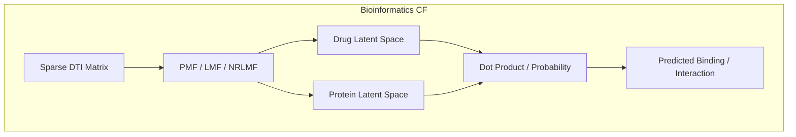

---

## 3. Content-Based Filtering (CBF)

### Concrete Example

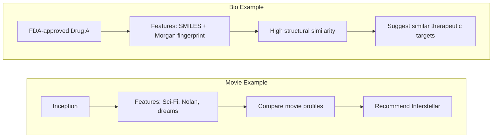

### The Movie Domain

* **Intuition:** "Because you watched a sci-fi movie directed by Christopher Nolan, we recommend another sci-fi movie directed by Christopher Nolan." It does not care about other users; it only cares about item features.
* **Simple Feature Table:**

| Movie | Genre | Director | Keywords |
| :--- | :--- | :--- | :--- |
| Inception | Sci-Fi | C. Nolan | dreams, mind-bending |
| Interstellar | Sci-Fi | C. Nolan | space, time-travel |
| Toy Story | Animation | John Lasseter | toys, kids |

* **Mathematical Concept:** Cosine Similarity. We calculate the cosine of the angle between two multi-dimensional feature vectors.
* **Real-World Examples & Tools:** [TF-IDF](#tf-idf), scikit-learn nearest neighbors, Elasticsearch "more like this", and content embeddings in modern catalog search.
* **Formula:**

$$
\text{Cosine}(A, B) = \frac{A \cdot B}{||A|| ||B||}
$$

**Formula symbols:**

| Symbol | Meaning |
| :--- | :--- |
| $A$ | Feature vector for the first item, such as the TF-IDF vector for *Inception*. |
| $B$ | Feature vector for the second item, such as the TF-IDF vector for *Interstellar*. |
| $A \cdot B$ | Dot product; large when both vectors have high values in the same feature positions. |
| $||A||$, $||B||$ | Vector lengths. Dividing by them makes the score depend on direction/profile similarity, not just vector size. |
| $\text{Cosine}(A,B)$ | Similarity score from -1 to 1 in general, and usually 0 to 1 for non-negative feature vectors like TF-IDF. |

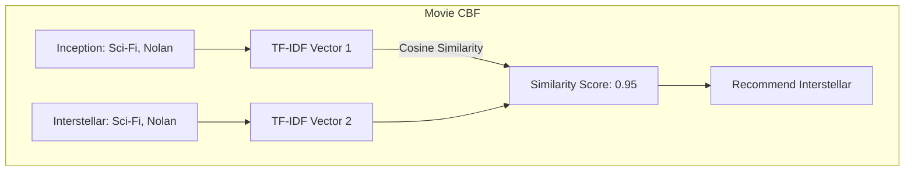

### The Bioinformatics Translation

* **Intuition:** "Because Drug A inhibits Target X, Drug B, which has a similar chemical structure, may also inhibit Target X."
* **Biological Context:** Structural homology. Molecules with similar shapes often perform similar biological functions.
* **Usage & Algorithms:** Calculating the [Tanimoto coefficient](#tanimoto-coefficient) to compare [Morgan fingerprints](#morgan-fingerprint).
* **Real-World Examples & Tools:** RDKit Morgan fingerprints, Open Babel, PubChem similarity search, ChEMBL similarity search, SwissSimilarity, and DeepPurpose.
* **Formula:**

$$
T(A, B) = \frac{A \cdot B}{||A||^2 + ||B||^2 - A \cdot B}
$$

**Formula symbols:**

| Symbol | Meaning |
| :--- | :--- |
| $A$ | Binary fingerprint vector for the first molecule, such as Drug A. |
| $B$ | Binary fingerprint vector for the second molecule, such as Drug B. |
| $A \cdot B$ | Number of fingerprint bits that are 1 in both molecules; shared chemical patterns. |
| $||A||^2$ | Number of 1 bits in Drug A's fingerprint. |
| $||B||^2$ | Number of 1 bits in Drug B's fingerprint. |
| $||A||^2 + ||B||^2 - A \cdot B$ | Number of bit positions where at least one molecule has a 1. |
| $T(A,B)$ | Tanimoto similarity, usually between 0 and 1; higher means more chemically similar. |

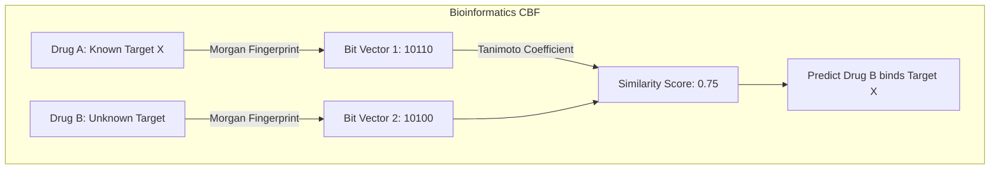

---

## 4. Graph-Based Methods

### Concrete Example

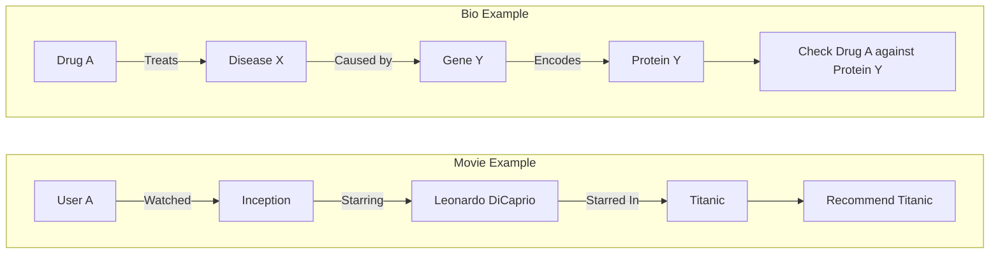

### The Movie Domain

* **Intuition:** "Everything is connected in a web." A user is connected to movies, movies to actors, actors to other movies, and so on.
* **Mathematical Concept:** [Random Walk with Restart (RWR)](#random-walk-with-restart-rwr). A walker moves randomly along graph edges, but with probability $c$ it jumps back to the starting node.
* **Why Restart Matters:** Without restart, the walker may drift far away and recommend generally popular nodes. Restart keeps the score personalized around the starting user, disease, or drug.
* **Real-World Examples & Tools:** PageRank, Personalized PageRank, Neo4j Graph Data Science, NetworkX, igraph, and graph-based recommenders in knowledge graphs.

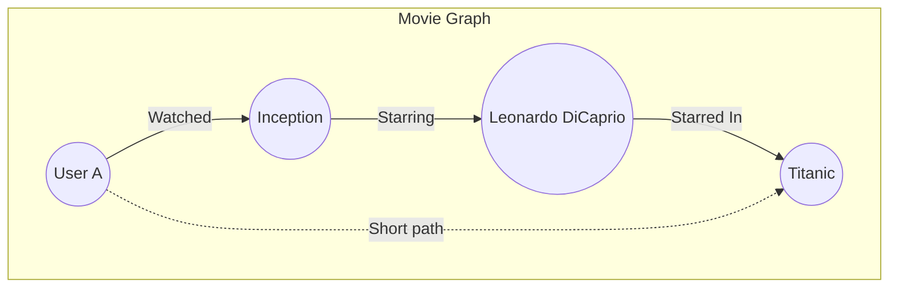

### The Bioinformatics Translation

* **Intuition:** "Disease X is caused by Gene Y, which physically interacts with Protein Z. We recommend Drug A because it targets a nearby biological neighborhood."
* **Biological Context:** [Protein-protein interaction (PPI) networks](#ppi-network). Maps showing which proteins physically or functionally interact in a cell.
* **Usage & Algorithms:** Disease-gene prioritization using RWR-HN (Random Walk on Heterogeneous Networks).
* **Real-World Examples & Tools:** STRING, BioGRID, Cytoscape, Hetionet, OpenTargets, and NetworkX/igraph pipelines for disease-gene prioritization.
* **Formula:** Let $W$ be the transition matrix and $p_t$ be the probability vector at time $t$. The steady state is reached via:

$$
p_{t+1} = (1-c) W p_t + c p_0
$$

**Bio formula explanation:**

| Symbol | Meaning |
| :--- | :--- |
| $p_0$ | Starting probability vector; for example, all probability starts at the disease node. |
| $p_t$ | Probability distribution over all nodes after $t$ steps. |
| $p_{t+1}$ | Updated probability distribution after one more step. |
| $W$ | Transition matrix; each entry says how likely the walker is to move from one node to another. |
| $c$ | Restart probability; higher $c$ keeps the walk closer to the starting node. |
| $(1-c)Wp_t$ | The part that walks through the graph. |
| $cp_0$ | The part that jumps back to the start. |
| Steady state | The final stable probability distribution when repeated updates barely change $p_t$. High-score nodes are close or strongly connected to the start. |

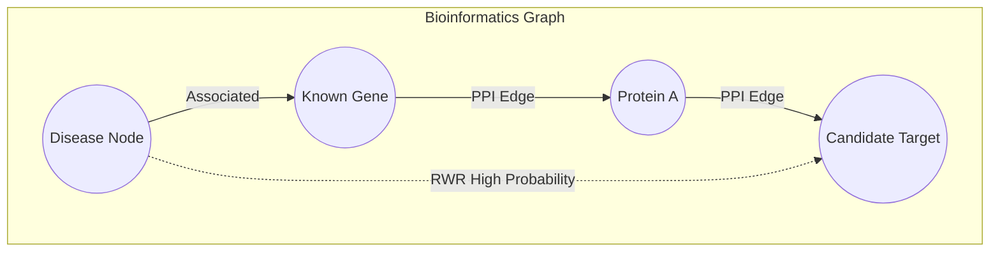

---

## 5. Deep Learning (Autoencoders)

### Concrete Example

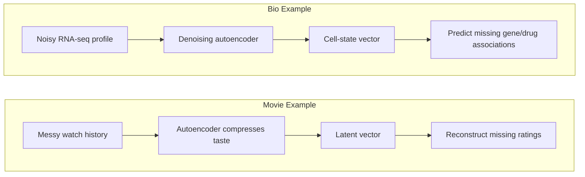

### The Movie Domain

* **Intuition:** "Compress a user's messy, incomplete watch history into a dense hidden code, then decode it to reconstruct the full profile with missing ratings filled in."
* **Mathematical Concept:** Autoencoder loss function. A neural network is trained to copy its input to its output through a narrow bottleneck layer.
* **How Missing Values Are Predicted:** During training, the model learns patterns from observed values. In denoising autoencoders, parts of the input are intentionally masked or corrupted, and the model learns to reconstruct them. After training, a missing rating or biological measurement can be filled in by the decoder's reconstruction.
* **Real-World Examples & Tools:** AutoRec, Variational Autoencoders (VAE), RecVAE, PyTorch, TensorFlow/Keras, and NVIDIA Merlin.


### The Bioinformatics Translation

* **Intuition:** "Biological lab tests are noisy and incomplete. We can map complex cellular profiles into a mathematical space and decode them to predict unobserved biological associations."
* **Biological Context:** [Omics data](#omics-profile), such as [RNA-seq](#rna-seq), is high-dimensional, noisy, sparse, and highly correlated.
* **The Multi-Omics Problem:** DNA, RNA, proteins, metabolites, clinical variables, and drug response are measured at different scales, with missing values and batch effects. The model must align these layers into one useful representation.
* **Usage & Algorithms:** Stacked Denoising Autoencoders (SDAE) for omics integration. They reduce dimensionality while filtering out biological noise.
* **Real-World Examples & Tools:** DeepDR, scVI/scANVI, DCA, MOFA+, TensorFlow, PyTorch, and Scanpy-based single-cell workflows.
* **Formula:** Minimizing Mean Squared Error (MSE) between input $x$ and reconstruction $\hat{x}$:

$$
L(x, \hat{x}) = ||x - \sigma(W' \sigma(Wx + b) + b')||^2
$$

**Meaning:** $x$ is the noisy or incomplete profile, $\hat{x}$ is the reconstructed profile, $W$ and $b$ are learned neural-network parameters, and $\sigma$ is a nonlinear activation function. Training makes $\hat{x}$ close to the reliable parts of $x$, so the reconstructed output can estimate missing entries.

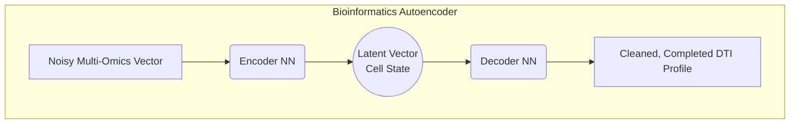

---

## 6. Graph Neural Networks (GNN)

### Concrete Example

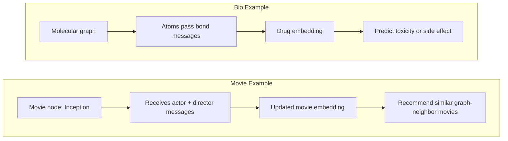

### The Movie Domain

* **Intuition:** "Nodes update their own identity vectors by listening to and aggregating information from their neighbors."
* **Mathematical Concept:** Graph Convolution / Message Passing.
* **Real-World Examples & Tools:** PinSage-style graph recommenders, GraphSAGE, LightGCN, PyTorch Geometric, DGL, and StellarGraph.
* **Pseudocode:**

```python
for node in graph:
    neighbor_messages = SUM(features of neighbors)
    node.features = NeuralNet(node.features + neighbor_messages)
```

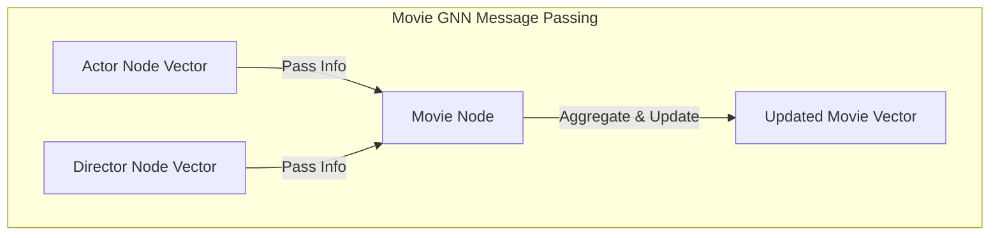

### The Bioinformatics Translation

* **Intuition:** "A drug's chemical properties are not just a 1D string; they depend on a graph of atoms and bonds. We aggregate information across this graph to predict toxicity, binding, or side effects."
* **Biological Context:** Polypharmacy. Multiple drugs can cause unexpected side effects because they interact with overlapping protein networks.
* **Usage & Algorithms:** Graph Convolutional Networks (GCN), including Decagon, for side-effect prediction and molecular property prediction.
* **Real-World Examples & Tools:** Decagon, DeepChem, DGL-LifeSci, PyTorch Geometric, Chemprop, and RDKit-backed molecular graph pipelines.
* **Formula (Layer Update):**

Before the formula, the graph is represented as an adjacency matrix. If atom 1 is bonded to atom 2, then the matrix has an edge entry for that connection. A **self-looped adjacency matrix** means we also add a node-to-itself edge for every node. In matrix form, this is usually $\tilde{A} = A + I$, where $I$ is the identity matrix. This lets each node keep its own current features while also receiving messages from neighbors.

$$
H^{(l+1)} = \sigma\left(\tilde{D}^{-\frac{1}{2}} \tilde{A} \tilde{D}^{-\frac{1}{2}} H^{(l)} W^{(l)}\right)
$$

**Formula symbols:**

| Symbol | Meaning |
| :--- | :--- |
| $A$ | Adjacency matrix; says which nodes are connected by edges. In a molecule, it says which atoms are bonded. |
| $I$ | Identity matrix; has 1s on the diagonal and 0s elsewhere. Adding it creates self-connections. |
| $\tilde{A}$ | Self-looped adjacency matrix, usually $A + I$. It contains normal edges plus each node's edge to itself. |
| $D$ | Degree matrix; a diagonal matrix where each diagonal value is the number of neighbors for a node. |
| $\tilde{D}$ | Degree matrix computed from $\tilde{A}$. |
| $H^{(l)}$ | Feature matrix at layer $l$; each row is a node's current embedding/features. |
| $W^{(l)}$ | Trainable weight matrix for layer $l$. |
| $\sigma$ | Nonlinear activation, such as ReLU. |
| $H^{(l+1)}$ | Updated node features after message passing. |

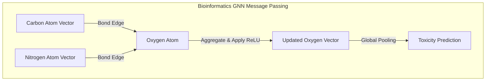

---

## 7. Reinforcement Learning (RL)

### Concrete Example

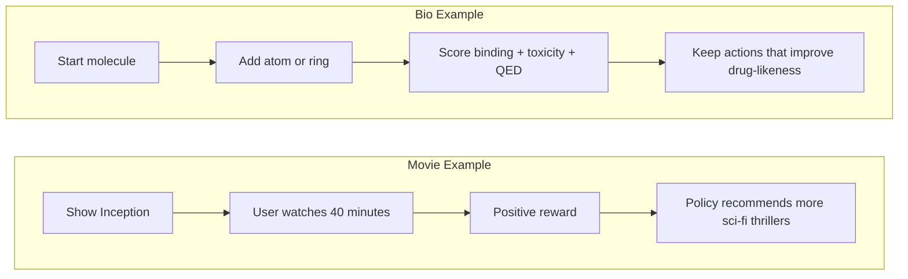

### The Movie Domain

* **Intuition:** "The system is an agent playing a game. It recommends a sequence of items, observes user engagement, and updates its strategy to maximize long-term reward."
* **Mathematical Concept:** Q-Learning / Markov Decision Process.
* **Real-World Examples & Tools:** Contextual bandits, LinUCB, Thompson Sampling, DQN-style recommenders, Vowpal Wabbit, Ray RLlib, and Microsoft Recommenders.

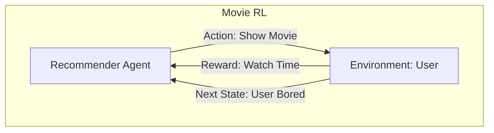

### The Bioinformatics Translation

* **Intuition:** "Instead of recommending an existing drug, build a new one atom by atom. If the simulation says it binds well and is not toxic, reward the AI."
* **Biological Context:** [De novo drug design](#de-novo-drug-design). Creating new molecular structures from scratch.
* **Usage & Algorithms:** Proximal Policy Optimization (PPO) in frameworks like GCPN (Graph Convolutional Policy Network).
* **Real-World Examples & Tools:** GCPN, REINVENT, MolDQN, RationaleRL, GuacaMol, MOSES, RDKit, and docking/reward loops with AutoDock Vina.
* **Formula (Bellman Equation):**

$$
Q(s, a) = \mathbb{E} [r_{t+1} + \gamma \max_{a'} Q(s_{t+1}, a') | s_t = s, a_t = a]
$$

**Meaning:** $Q(s,a)$ is the expected long-term reward for taking action $a$ in state $s$. In molecule generation, the state can be the current molecule, the action can be adding an atom or bond, and the reward can combine binding affinity, toxicity, synthetic accessibility, and [QED](#qed-score).

**Formula symbols:**

| Symbol | Meaning |
| :--- | :--- |
| $s$ | Current state. In drug design, this can be the current partial molecule. |
| $a$ | Current action. For example, add an atom, add a bond, or stop generation. |
| $Q(s,a)$ | Expected long-term value of taking action $a$ in state $s$. |
| $\mathbb{E}$ | Expected value; average outcome over possible future paths. |
| $r_{t+1}$ | Immediate reward after taking the action, such as better binding or lower toxicity. |
| $\gamma$ | Discount factor between 0 and 1; controls how much future rewards matter. |
| $s_{t+1}$ | Next state after the action, such as the updated molecule. |
| $a'$ | A possible next action from the next state. |
| $\max_{a'} Q(s_{t+1}, a')$ | Best predicted future value after reaching the next state. |
| $s_t = s, a_t = a$ | Condition saying we are evaluating the case where the current state is $s$ and the current action is $a$. |

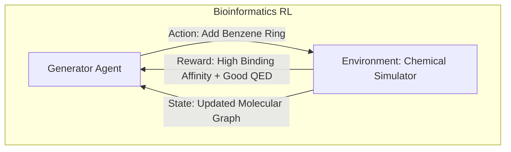

---

## Appendix: Simple Biology and Math Glossary

### DTI: Drug-Target Interaction

A DTI asks whether a drug interacts with a biological target, usually a protein. It can be binary (`binds` / `does not bind`) or continuous (how strongly it binds).

Example DTI row:

| Drug | EGFR | BRAF | ACE2 |
| :--- | ---: | ---: | ---: |
| Drug A | 1 | 0 | ? |

Here, `?` means the interaction is unknown and may be predicted.

### Protein Target

A protein that a drug tries to bind, block, activate, or modify. For example, a cancer drug may target EGFR, a protein involved in cell-growth signaling.

### Gene

A DNA instruction that can be used to make RNA and often a protein. A disease gene is a gene whose mutation or abnormal activity is linked to a disease.

### Binding Affinity, Kd, and IC50

Binding affinity describes how strongly a drug binds to a target.

| Term | Simple Meaning |
| :--- | :--- |
| **Kd** | Dissociation constant. Lower Kd means tighter binding. |
| **IC50** | Concentration needed to inhibit 50% of a biological activity. Lower IC50 usually means stronger effect. |

Example: If Drug A has IC50 = 10 nM and Drug B has IC50 = 1000 nM for the same target, Drug A is usually considered more potent for that assay.

### SMILES

SMILES is a text string that represents a molecule.

Examples:

| Molecule | Example SMILES |
| :--- | :--- |
| Ethanol | `CCO` |
| Benzene | `c1ccccc1` |
| Aspirin | `CC(=O)Oc1ccccc1C(=O)O` |

The recommender cannot directly "see" a molecule, so SMILES is one way to convert chemistry into machine-readable input.

### Morgan Fingerprint

A Morgan fingerprint is a binary vector describing circular neighborhoods around atoms. It is often computed with RDKit.

Toy example:

| Molecule | Fingerprint |
| :--- | :--- |
| Drug A | `10110010` |
| Drug B | `10100010` |

Matching 1s mean the molecules share local chemical patterns. Real fingerprints are usually much longer, such as 1024 or 2048 bits.

### Tanimoto Coefficient

The Tanimoto coefficient measures similarity between binary chemical fingerprints.

For binary vectors:

$$
T(A, B) = \frac{\text{shared 1 bits}}{\text{1 bits in A or B}}
$$

Toy example:

* Drug A fingerprint: `101100`
* Drug B fingerprint: `101000`
* Shared 1 bits: 2
* 1 bits in either A or B: 3
* Tanimoto score: $2/3 = 0.67$

### TF-IDF

TF-IDF means Term Frequency-Inverse Document Frequency. It gives high weight to words that are common in one document but uncommon across all documents.

Movie example:

| Movie | Keywords | TF-IDF-like Feature |
| :--- | :--- | :--- |
| Inception | dreams, mind, Nolan | high weight on `dreams` |
| Interstellar | space, time, Nolan | high weight on `space` |

In biology, a similar idea can be used for text mining biomedical abstracts or drug descriptions.

### Omics Profile

An omics profile is a vector of biological measurements.

Example RNA-seq profile:

| Sample | TP53 | EGFR | MYC | BRCA1 |
| :--- | ---: | ---: | ---: | ---: |
| Patient 1 | 8.2 | 2.1 | 10.5 | 4.4 |

Each number may represent gene expression level. A recommender can use this vector as a patient or disease feature.

### RNA-seq

RNA-seq measures which genes are active by counting RNA molecules. If a gene has many RNA reads, it is likely highly expressed in that sample.

### Multi-Omics

Multi-omics combines multiple biological layers.

| Layer | What It Measures | Example Feature |
| :--- | :--- | :--- |
| Genomics | DNA variants | `BRAF V600E mutation` |
| Transcriptomics | RNA expression | `EGFR expression = 2.1` |
| Proteomics | Protein abundance | `Protein X high` |
| Metabolomics | Small molecules | `Lactate high` |
| Clinical | Patient information | `Age, stage, survival` |

The problem is that these layers have different units, missing values, noise, and batch effects. Autoencoders and other representation-learning methods try to compress them into one shared latent profile.

### PPI Network

A protein-protein interaction network is a graph where nodes are proteins and edges mean physical or functional interaction.

Example:

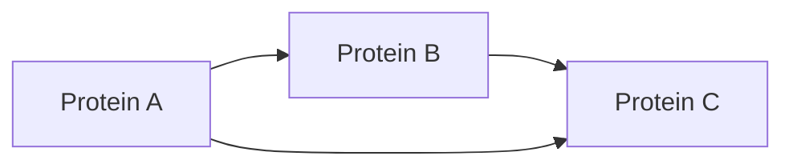

### Random Walk with Restart (RWR)

RWR repeatedly mixes two behaviors:

1. Walk to a neighboring node.
2. Restart at the original node.

Restart is useful because it keeps the ranking local. In disease-gene prediction, if the start node is a disease, high-scoring genes are those that remain close to the disease through many possible paths.

### LMF, RLMF, and NRLMF

Logistic Matrix Factorization (LMF) predicts a probability instead of a star rating. It is useful for binary data such as "drug binds target" vs. "drug does not bind target."

* **RLMF** often refers to Regularized Logistic Matrix Factorization: LMF with regularization to avoid overfitting.
* **NRLMF** means Neighborhood Regularized Logistic Matrix Factorization. It adds the idea that similar drugs and similar targets should have similar latent vectors.

### QED Score

QED estimates how drug-like a molecule is. It combines properties such as molecular weight, polarity, aromatic rings, and other chemistry rules into one score.

### Toxicity

Toxicity is the chance that a molecule causes harmful biological effects. In drug design, high binding affinity alone is not enough; a molecule also needs acceptable toxicity, solubility, stability, and synthesizability.

### Drug Repurposing

Drug repurposing means finding a new disease use for an existing drug. It is attractive because the safety profile of the drug may already be partially known.

### De Novo Drug Design

De novo drug design means designing a new molecule from scratch instead of selecting from existing drugs.
